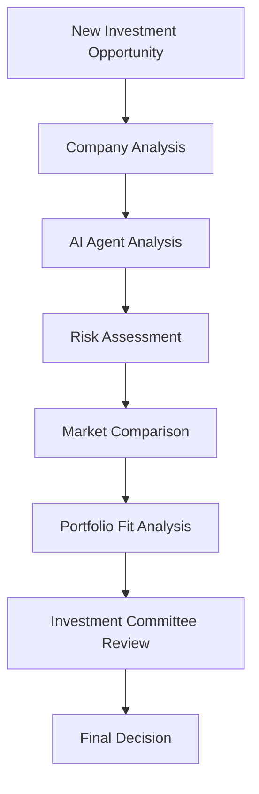

# 🚀 CS Intelligence Platform - Complete Workflow Guide

## **📋 Table of Contents**
1. [System Startup Workflow](#system-startup-workflow)
2. [Daily Operations Workflow](#daily-operations-workflow)
3. [Executive Decision Making Workflow](#executive-decision-making-workflow)
4. [Investment Analysis Workflow](#investment-analysis-workflow)
5. [Data Management Workflow](#data-management-workflow)
6. [AI Agent Configuration Workflow](#ai-agent-configuration-workflow)
7. [Funding Intelligence Workflow](#funding-intelligence-workflow)
8. [Troubleshooting Workflow](#troubleshooting-workflow)
9. [Maintenance Workflow](#maintenance-workflow)
10. [Emergency Procedures](#emergency-procedures)

---

## 🔄 **System Startup Workflow**

### **Daily Startup Checklist**
```bash
# 1. Navigate to project directory
cd /Users/samuelmcfarlane/ballistic-intelligence-platform

# 2. Check for updates
git pull origin master

# 3. Install any new dependencies
npm install

# 4. Start the development server
npm run dev

# 5. Verify server is running
curl -s -o /dev/null -w "%{http_code}" http://localhost:3000
# Expected: 200

# 6. Run endpoint verification
node test-all-endpoints.js
```

### **Startup Verification Steps**
1. **Server Status**: Confirm localhost:3000 is responding
2. **API Health**: Test all 6 major API endpoints
3. **Data Sources**: Verify 7 data sources are connected
4. **AI Agents**: Confirm 5 agents are operational
5. **Portfolio Data**: Check $1.2B portfolio tracking is active

---

## 📊 **Daily Operations Workflow**

### **Morning Routine (9:00 AM)**
1. **Executive Dashboard Review**
   - Navigate to: `http://localhost:3000/executive-dashboard`
   - Review overnight portfolio changes
   - Check AI insights summary
   - Analyze security metrics updates

2. **Funding Intelligence Check**
   - Access: `http://localhost:3000/api/funding-agent?action=demo`
   - Review new funding announcements
   - Analyze market trends and hot sectors
   - Identify potential investment opportunities

3. **Data Sources Health Check**
   - Visit: `http://localhost:3000/data-sources`
   - Verify all 7 sources are syncing properly
   - Check success rates (target: >95%)
   - Review data freshness timestamps

### **Midday Analysis (12:00 PM)**
1. **Portfolio Performance Review**
   - Access: `http://localhost:3000/ballistic-portfolio`
   - Analyze company performance metrics
   - Review risk assessments
   - Check exit pipeline updates

2. **AI Agent Monitoring**
   - Navigate to: `http://localhost:3000/ai-agents`
   - Review agent performance metrics
   - Adjust confidence levels if needed
   - Check analysis completion rates

### **End of Day Summary (6:00 PM)**
1. **Generate Daily Report**
   - Compile key metrics from all dashboards
   - Summarize funding announcements
   - Document any system issues
   - Plan next day priorities

---

## 🎯 **Executive Decision Making Workflow**

### **Investment Decision Process**


### **Step-by-Step Process**
1. **Initial Screening**
   - Use funding agent to identify opportunities
   - Check company against portfolio criteria
   - Verify cybersecurity sector alignment

2. **Deep Analysis**
   - Navigate to company analysis page
   - Review financial metrics and growth rates
   - Analyze competitive positioning
   - Assess technology differentiation

3. **AI-Powered Insights**
   - Configure AI agents for specific analysis
   - Generate confidence scores and recommendations
   - Review risk factors and mitigation strategies
   - Compare against similar portfolio companies

4. **Decision Documentation**
   - Record analysis results in system
   - Document decision rationale
   - Update portfolio tracking
   - Set monitoring alerts

---

## 📈 **Investment Analysis Workflow**

### **New Company Evaluation**
1. **Data Collection**
   ```bash
   # Access company analysis
   curl "http://localhost:3000/api/rag-analysis?action=company-analysis&company=TARGET_COMPANY"
   ```

2. **Multi-Dimensional Analysis**
   - **Financial**: Revenue, growth, burn rate, runway
   - **Technology**: Platform assessment, IP portfolio, differentiation
   - **Market**: TAM/SAM, competitive landscape, positioning
   - **Team**: Leadership experience, technical expertise
   - **Risk**: Identified risks with severity and mitigation

3. **AI Agent Configuration**
   - Set Technical Analyst for platform evaluation
   - Configure Market Analyst for competitive analysis
   - Enable Financial Analyst for metrics review
   - Activate Threat Analyst for security assessment

4. **Comparative Analysis**
   - Compare against existing portfolio companies
   - Benchmark against market standards
   - Analyze synergy opportunities
   - Assess diversification impact

### **Portfolio Company Monitoring**
1. **Regular Health Checks**
   - Monthly performance reviews
   - Quarterly deep dives
   - Annual strategic assessments

2. **Alert-Based Monitoring**
   - Set up automated alerts for key metrics
   - Monitor funding announcements in sector
   - Track competitive developments
   - Watch for exit opportunities

---

## 🔧 **Data Management Workflow**

### **Data Source Management**
1. **Daily Sync Verification**
   ```bash
   # Check data source status
   curl "http://localhost:3000/api/data-sources/sync?action=status"
   ```

2. **Weekly Data Quality Review**
   - Verify record counts and freshness
   - Check for data anomalies
   - Validate API connections
   - Review success rates

3. **Monthly Data Cleanup**
   - Remove duplicate records
   - Archive old data
   - Update data source configurations
   - Optimize query performance

### **Data Source Configuration**
1. **Adding New Sources**
   - Navigate to Data Sources Manager
   - Configure API credentials
   - Set sync frequency and retention
   - Test connection and data quality

2. **Managing Existing Sources**
   - Monitor performance metrics
   - Adjust rate limits as needed
   - Update API keys when expired
   - Optimize data filtering

---

## 🤖 **AI Agent Configuration Workflow**

### **Agent Setup Process**
1. **Initial Configuration**
   - Navigate to: `http://localhost:3000/ai-agents`
   - Select agent type (Technical, Market, Threat, Financial, Patent)
   - Set confidence thresholds
   - Configure analysis depth

2. **Custom Prompts**
   - Define specific analysis requirements
   - Set industry focus areas
   - Configure output formats
   - Establish quality criteria

3. **Performance Tuning**
   - Monitor analysis accuracy
   - Adjust confidence levels
   - Refine prompt engineering
   - Optimize response times

### **Agent Monitoring**
1. **Daily Performance Check**
   - Review completion rates
   - Check accuracy scores
   - Monitor response times
   - Identify any errors

2. **Weekly Optimization**
   - Analyze agent performance trends
   - Adjust configuration parameters
   - Update training data if needed
   - Refine analysis criteria

---

## 💰 **Funding Intelligence Workflow**

### **Automated Funding Tracking**
1. **Daily Funding Scan**
   ```bash
   # Run funding intelligence
   curl "http://localhost:3000/api/funding-agent?action=run"
   ```

2. **Analysis Review**
   - Review new funding announcements
   - Analyze sector trends and patterns
   - Identify potential investment targets
   - Track competitor funding activities

3. **Opportunity Assessment**
   - Evaluate funding stage alignment
   - Assess market timing factors
   - Review investor syndicate patterns
   - Identify co-investment opportunities

### **Market Intelligence**
1. **Trend Analysis**
   - Monitor hot sectors and themes
   - Track funding stage distributions
   - Analyze investor activity patterns
   - Identify emerging opportunities

2. **Competitive Intelligence**
   - Track competitor funding rounds
   - Monitor market consolidation
   - Analyze valuation trends
   - Assess market positioning

---

## 🔍 **Troubleshooting Workflow**

### **Common Issues and Solutions**

#### **Server Not Responding**
```bash
# Check if server is running
lsof -i :3000

# If no process, restart server
npm run dev

# Verify connection
curl -s -o /dev/null -w "%{http_code}" http://localhost:3000
```

#### **API Endpoints Failing**
```bash
# Test specific endpoint
curl "http://localhost:3000/api/ballistic-portfolio?action=stats"

# Check server logs
tail -f server.log

# Restart if needed
pkill -f "next dev"
npm run dev
```

#### **Data Source Connection Issues**
1. Check API credentials and rate limits
2. Verify network connectivity
3. Review error logs in Data Sources Manager
4. Test individual source connections

#### **AI Agent Performance Issues**
1. Check agent configuration settings
2. Review prompt engineering
3. Monitor API rate limits
4. Verify data quality inputs

### **Emergency Recovery**
```bash
# Full system restart
pkill -f "next dev"
rm -rf .next
npm install
npm run build
npm run dev
```

---

## 🛠️ **Maintenance Workflow**

### **Weekly Maintenance**
1. **System Health Check**
   - Run comprehensive endpoint tests
   - Review performance metrics
   - Check error logs
   - Verify data integrity

2. **Data Cleanup**
   - Archive old records
   - Remove duplicates
   - Update stale data
   - Optimize database queries

3. **Security Review**
   - Check API key expiration
   - Review access logs
   - Update security configurations
   - Verify compliance status

### **Monthly Maintenance**
1. **Performance Optimization**
   - Analyze response times
   - Optimize database queries
   - Review caching strategies
   - Update dependencies

2. **Feature Updates**
   - Review user feedback
   - Plan new feature development
   - Update documentation
   - Test new integrations

### **Quarterly Maintenance**
1. **Strategic Review**
   - Assess system performance against goals
   - Review ROI and business impact
   - Plan major upgrades
   - Evaluate new data sources

2. **Disaster Recovery Testing**
   - Test backup and recovery procedures
   - Verify data integrity
   - Update emergency contacts
   - Review security protocols

---

## 🚨 **Emergency Procedures**

### **System Down Emergency**
1. **Immediate Response**
   - Check server status and logs
   - Identify root cause
   - Implement quick fix if possible
   - Communicate status to stakeholders

2. **Recovery Process**
   - Execute recovery procedures
   - Verify data integrity
   - Test all critical functions
   - Document incident and resolution

### **Data Breach Response**
1. **Immediate Actions**
   - Isolate affected systems
   - Assess scope of breach
   - Notify security team
   - Document all actions

2. **Recovery and Prevention**
   - Implement security patches
   - Review access controls
   - Update security procedures
   - Conduct post-incident review

---

## 📋 **Quick Reference Commands**

### **Daily Commands**
```bash
# Start system
npm run dev

# Test all endpoints
node test-all-endpoints.js

# Check funding intelligence
curl "http://localhost:3000/api/funding-agent?action=demo"

# Verify portfolio data
curl "http://localhost:3000/api/ballistic-portfolio?action=stats"
```

### **Troubleshooting Commands**
```bash
# Check port usage
lsof -i :3000

# Kill server process
pkill -f "next dev"

# Clean restart
rm -rf .next && npm run dev

# Test connection
curl -s -o /dev/null -w "%{http_code}" http://localhost:3000
```

---

## 🎯 **Success Metrics**

### **Daily KPIs**
- System uptime: >99%
- API response time: <500ms
- Data source success rate: >95%
- AI agent completion rate: >90%

### **Weekly KPIs**
- New funding opportunities identified: >10
- Portfolio analysis updates: 100%
- Data quality score: >95%
- User satisfaction: >4.5/5

### **Monthly KPIs**
- Investment decisions supported: Track count
- ROI from intelligence insights: Measure impact
- System performance improvements: Document gains
- Feature adoption rate: Monitor usage

---

## 🚀 **Workflow Summary**

The CS Intelligence Platform workflow ensures:
- **Reliable Operations**: Consistent daily startup and monitoring
- **Data-Driven Decisions**: Comprehensive analysis and AI insights
- **Proactive Management**: Regular maintenance and optimization
- **Emergency Preparedness**: Clear procedures for issue resolution
- **Continuous Improvement**: Regular review and enhancement

**🎯 Follow this workflow to maximize the value and reliability of your cybersecurity investment intelligence platform!**